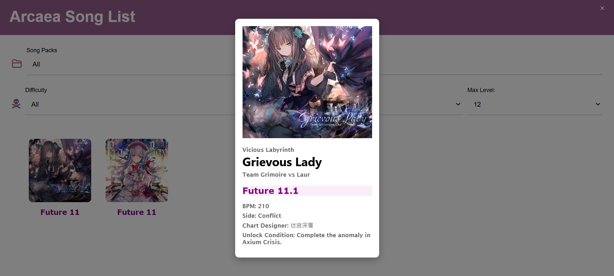
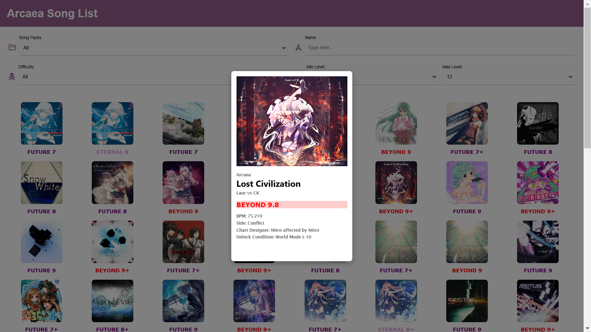

# Arcaea Web Project
This is the web project for the Arcaea mobile game. The idea is to create a website that allows players to fetch the information about songs, characters, and any other elements of the game. 

## Daily Updates

Date: 2025.1.28
- [x] Import songs from "Arcaea" pack.
- [x] Display songs on the website dynamically.
- [x] Song info card can be displayed when clicking on a song ans closed when clicking outside.
  
## Tomorrow's Plan
- Generate song information in JSON format.
- Write JavaScript code to fetch the data and display it on the website.
- Some text may have to change its color accordingly to make it more readable. (See Note 3)

## Note
* Since multi-selection will be very ugly if using `multiple` attribute, I will use checkboxes instead later in the dynamic front-end stage.
* Some of the text may be better to change colors depending on the context.
* For now, we just use the dummy data.

## Appearence Progress 

## Reference
The project is inspired by [this website](https://arcade-songs.zetaraku.dev/maimai/). It provides a good reference for the design and functionality of the website about acrade music games.